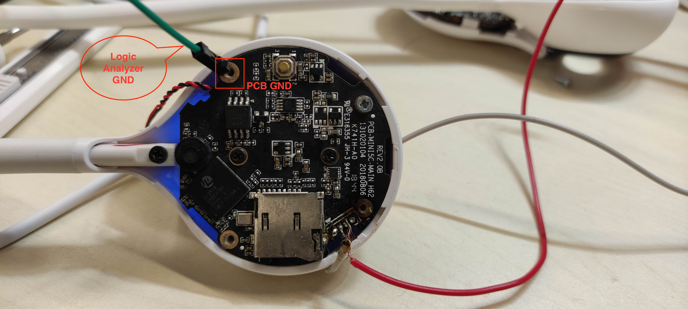
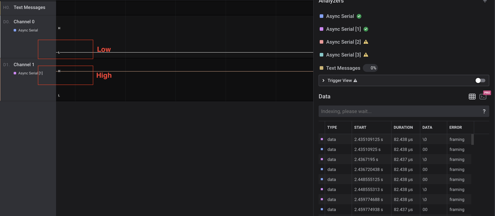
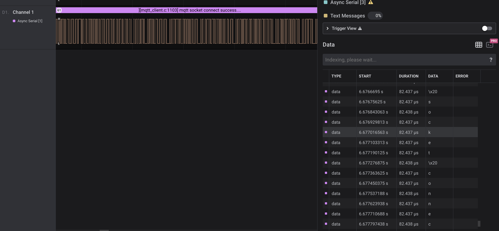

# 逻辑分析仪查找UART接口
Author:  
xiaoyu.wang

## 逻辑分析仪介绍
逻辑分析仪是分析数字系统逻辑关系的仪器。逻辑分析仪是属于数据域测试仪器中的一种总线分析仪，即以总线（多线）概念为基础，同时对多条数据线上的数据流进行观察和测试的仪器，这种仪器对复杂的数字系统的测试和分析十分有效。逻辑分析仪是利用时钟从测试设备上采集和显示数字信号的仪器，最主要作用在于时序判定。由于逻辑分析仪不像示波器那样有许多电压等级，通常只显示两个电压（逻辑1和0），因此设定了参考电压后，逻辑分析仪将被测信号通过比较器进行判定，高于参考电压者为High,低于参考电压者为Low，在High与 Low之间形成数字波形。  

## 使用逻辑分析仪查找UART各接口
UART包含四个接口：GND TX RX VCC
通常在设备PCB板上四个触点连成一排的即为UART口。
### 第一步
将逻辑分析仪的GND接到PCB板的GND上，通常直接接到PCB板上空心的铜盘上即可。如下图:

### 第二步
使用逻辑分析仪确定UART GND。UART中的TX、RX、VCC都对应着高电平，只有GND对应着低电平。TX和RX在有数据传输时，会有电平跳动。如下图：

TX接口有数据传输时的状态：

### 第三步
通常TX和RX口都会有数据传输带来的电平波动，只有VCC接口始终处于高电平。可通过该特征确定VCC接口。另外，也可使用万用表确定VCC接口。

