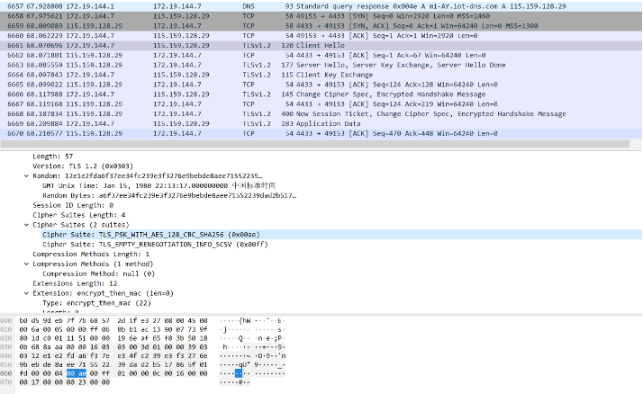

# 通讯加密
---
## 一、测试编号
tuya-nw-001

## 二、测试项目
通讯数据加密检测
## 三、测试目的
检查设备通讯数据是否加密或者使用TLS传输

## 四、测试条件
可使用抓包工具捕获流量

## 五、测试步骤
1、	参考操作
利用抓包工具，在设备与服务端通信阶段进行数据捕获；对捕获的数据进行分析，查看传输的数据是否使用TLS协议或者加密。    
2、	补充操作说明  

## 六、通过标准
通过：传输的数据使用TLS协议或者私有加密协议；
不通过：明文数据传输。

## 七、测试结果
□通过（OK） □部分通过（POK） □不通过（NOK）

## 八、测试说明
  
  
## 九、测试用例详细指南